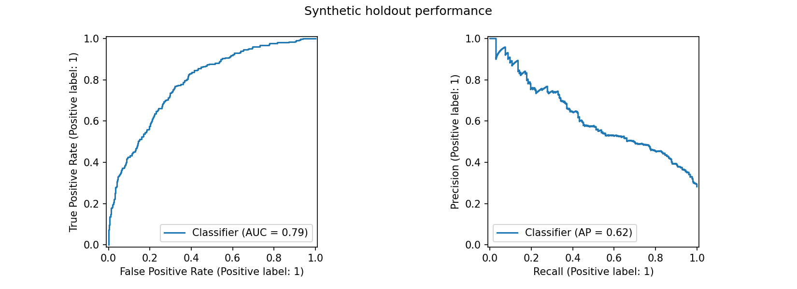
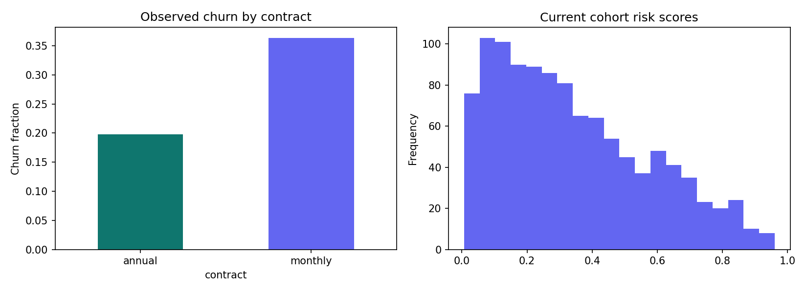

# Customer Churn Prediction and Retention System

A reproducible portfolio project by Kavali Harshavardhan, built with Python, SQL, scikit-learn and Streamlit. Predicts 30-day cancellation risk, ranks an outreach queue and suggests rule-based retention actions.

**Data: entirely synthetic. No real customer records or measured business impact.** The simulator intentionally links usage, contract and billing patterns with churn. Model scores demonstrate technical execution and do not establish real-world performance.

Read [the complete illustrated PDF guide](docs/Customer_Churn_Project_Complete_Guide.pdf) for the workflow, results, setup and interview explanation.

## Hosted browser demo

[Open Customer Retention Studio](https://harsha-customer-retention.kavaliharshavardhan9.chatgpt.site) (public access). The browser companion includes batch CSV and single-customer scoring, a capacity-limited outreach queue, model evaluation and the PDF guide. The Python project remains available for training, Streamlit and monitoring.

Read [the architecture and workflow](docs/ARCHITECTURE.md) and [completion status](docs/COMPLETION.md).

## Start here (Windows / VS Code)
1. Extract the ZIP and open this folder in VS Code.
2. Install Python 3.11 or 3.12. Open Terminal → New Terminal.
3. Run:
```powershell
py -3.11 -m venv .venv
.venv\Scripts\python -m pip install -r requirements.txt
.venv\Scripts\python -m streamlit run app.py
```
If you installed Python 3.12, replace `-3.11` with `-3.12`. A trained model and generated outputs are already included. Open the localhost URL printed in the terminal.

To reproduce everything and run tests:
```powershell
.venv\Scripts\python -m src.pipeline
.venv\Scripts\python -m unittest discover -s tests -v
```

macOS/Linux:
```bash
python3 -m venv .venv
.venv/bin/python -m pip install -r requirements.txt
.venv/bin/python -m src.pipeline
.venv/bin/python -m streamlit run app.py
```

## Deliverables
- `app.py`: interactive dashboard, contract filter, outreach capacity slider, CSV upload and prediction download.
- `src/pipeline.py`: seeded simulator, cleaning, temporal split, four-model comparison, evaluation, plots and SQLite exports.
- `src/core.py`: shared input validation, feature preparation, scoring and action rules.
- `src/monitor.py`: batch data-drift checks and optional delayed-label evaluation.
- `notebooks/01_analysis.ipynb`: exploratory analysis, SQL and results walkthrough.
- `data/`: raw/clean data, current cohort, scores, outreach list and SQLite database.
- `models/churn_model.joblib`: fitted preprocessing plus selected model and threshold.
- `reports/`: actual evaluation metrics, model comparison, split IDs, charts, data-quality audit and findings.
- `sql/analysis.sql`: four reproducible business queries.
- `docs/`: data dictionary, model card, Power BI instructions/DAX, interview and deployment guides.
- `tests/`: leakage, input validation, scoring, monitoring and app smoke checks.
- `Dockerfile` and `.github/workflows/tests.yml`: deployment configuration and CI.

## Design decisions
Churn means cancellation in the 30 days following the snapshot. Usage_previous and usage_current are the two 30-day windows ending before the snapshot. Billing failures and support tickets also describe the preceding 30 days. The outcome is never used as an input.

There are 6,600 unique customers across six cohorts, plus 20 exact duplicates in the raw source. Each customer appears once. Jan/Mar/May train, July validates, September tests, November simulates a scoring cohort. Two-month gaps ensure the 30-day outcome window closes before the next split. Median/mode imputation and encoding fit on training only. No resampling is needed for the simulated class distribution.

Compare Dummy, Logistic Regression, Random Forest and Histogram Gradient Boosting by validation average precision. Select a threshold that flags no more than 20% of validation customers, then evaluate once on the test set. Contact volume on new cohorts can differ; use the app's capacity limit. The shipped model is the evaluated training-only model, without later refitting.

Risk bands are descriptive (<30%, 30–60%, >60%) and independent of the contact cutoff. Actions use observed rules in priority order: billing failure, repeated support tickets, usage decline, then general needs review. They are not per-customer feature attributions. Global permutation importance is measured on validation data.

## Results
Read [reports/RESULTS.md](reports/RESULTS.md) for generated measurements and caveats.




## Publishing status
This project is published in the public repository at https://github.com/harshakavali81-collab/Customer-Churn-Prediction-and-Retention-System and is runnable locally. The browser companion is publicly hosted at https://harsha-customer-retention.kavaliharshavardhan9.chatgpt.site. The Streamlit app can also be run locally or deployed separately. The PDF records build-time publication status; this README carries current links. No secrets are needed for the local demo.

## Replacing synthetic data
Adapt your source to the data dictionary; implement consented extraction, as-of joins and an outcome maturity filter. Repeated customers require grouped temporal splitting. This generator is not a general real-data trainer: replace `generate()` and the hardcoded cohort splits before real use. Validate calibration, subgroup performance and treatment impact separately. Never upload private customer data into a public repository or public demo.
