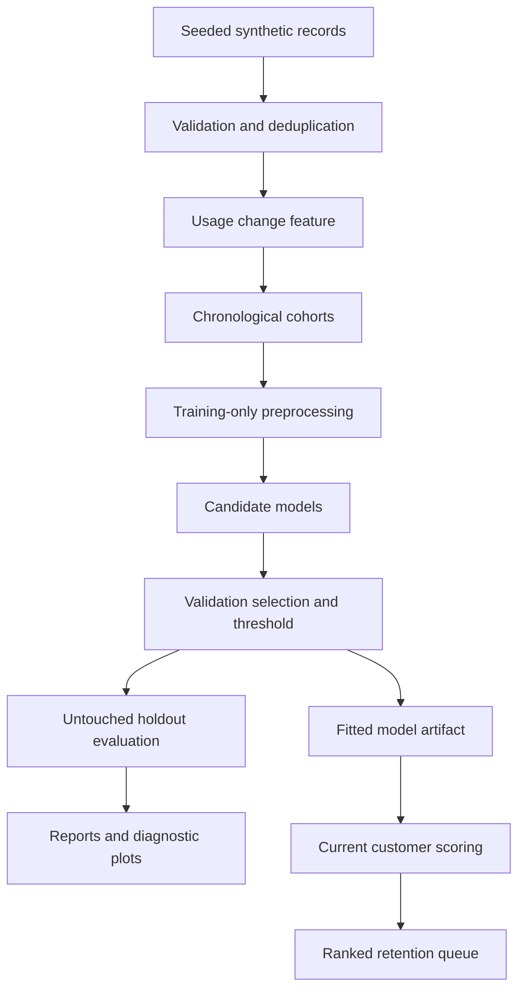
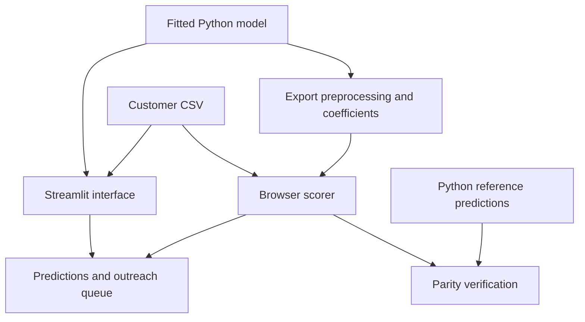
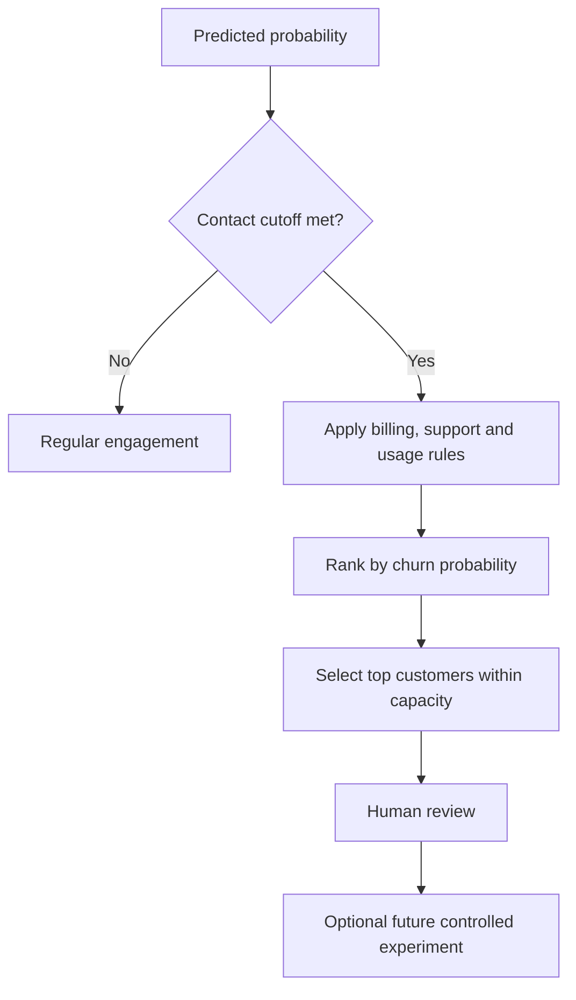

# System architecture and workflow

## Offline model training

The target describes cancellation in the 30 days after a snapshot. All model inputs are observed before the snapshot. Each simulated customer occurs once. The two-month cohort spacing provides an outcome-maturity gap.

## Two interfaces, one trained model

The browser export supports the selected Logistic Regression model. It includes training medians/modes, standardization values, category order, coefficients, intercept and contact threshold. Browser inference matches Python across 1,103 records to less than 1e-9 absolute probability error. Changing the selected estimator to a tree model requires a new browser implementation; export fails explicitly for unsupported models.

## Retention decision

The app does not send messages or contact customers. Risk ranking is not treatment-effect estimation. The action rules choose the first matching issue and must be tested before business impact is claimed.

## Files and reproduction

| Component | Entry point |
|---|---|
| Training and reporting | `python -m src.pipeline` |
| Streamlit dashboard | `python -m streamlit run app.py` |
| Model export | `python -m src.export_browser --output browser-demo/dist` |
| Browser parity tests | `cd browser-demo` then `node test-parity.mjs` |
| Browser local preview | `python -m http.server 8000 --directory browser-demo/dist` |
| Monitoring | `python -m src.monitor --input data/current_customers.csv` |

Open the local preview at `http://localhost:8000`. Do not double-click index.html, because browser module and JSON loading require an HTTP server.

The static demo processes user-supplied CSV files in browser memory. It does not upload them to a prediction backend or persist them after refresh. The Python project remains the source for training and monitoring.
